# Assignment: Deploy a .NET API on Azure Virtual Machine Using Docker 

## 1. Created a virtual machine in azure.
Created a Linux VM in Azure with Ubuntu image.
Allowed SSH(22) and HTTP(80) ports.

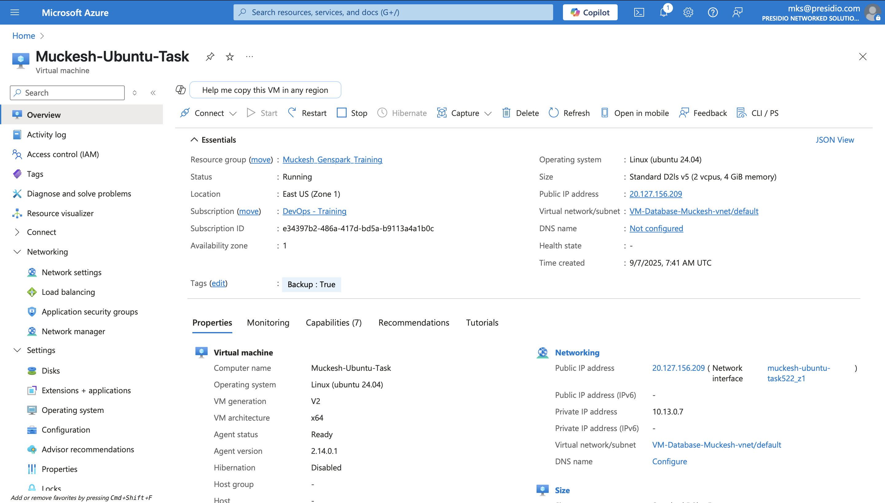

## 2. Created a sample dotnet webapi and dockerized it.

### Dockerfile
```
FROM mcr.microsoft.com/dotnet/sdk:8.0@sha256:35792ea4ad1db051981f62b313f1be3b46b1f45cadbaa3c288cd0d3056eefb83 AS build
WORKDIR /App

COPY . ./

RUN dotnet restore

RUN dotnet publish -o out

FROM mcr.microsoft.com/dotnet/aspnet:8.0@sha256:6c4df091e4e531bb93bdbfe7e7f0998e7ced344f54426b7e874116a3dc3233ff
WORKDIR /App
COPY --from=build /App/out .

EXPOSE 80
ENTRYPOINT ["dotnet", "TestApi.dll"]

```

Built the docker image using the following command.

```
docker build -t docker-testapi .
```

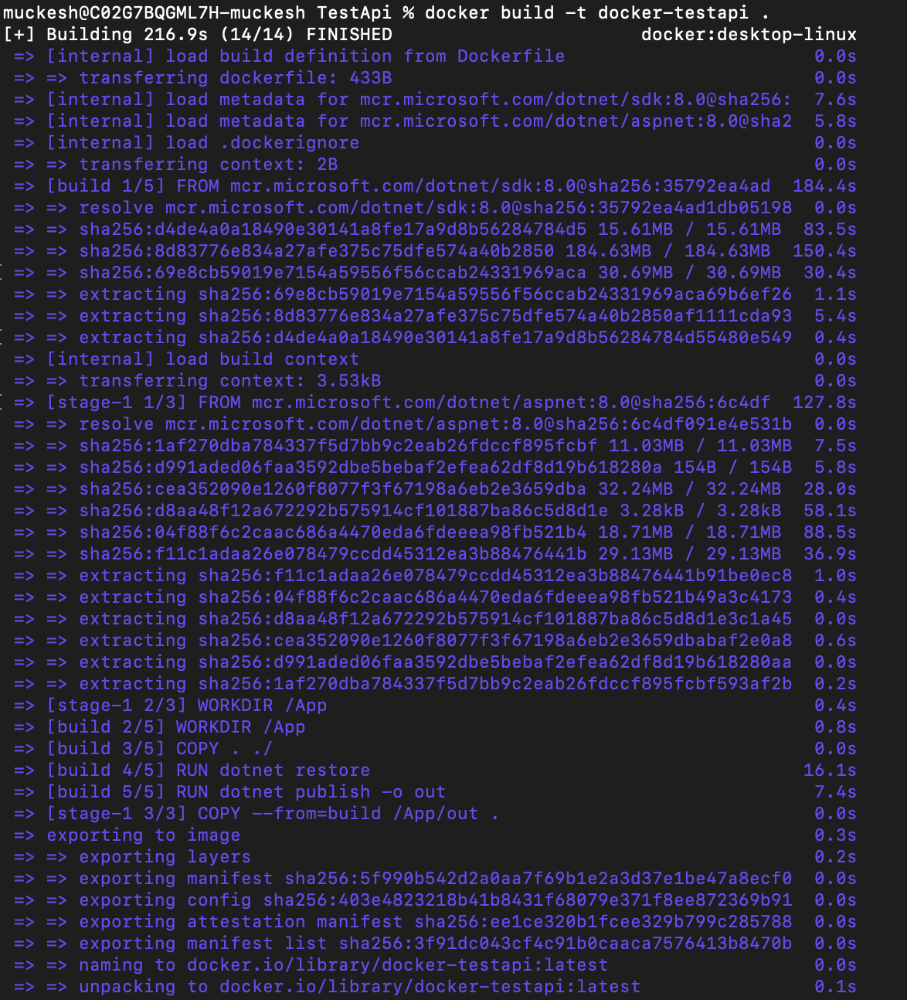

## 3. Pushed the docker image to docker hub.

Logged into docker and pushed the the image to docker hub.

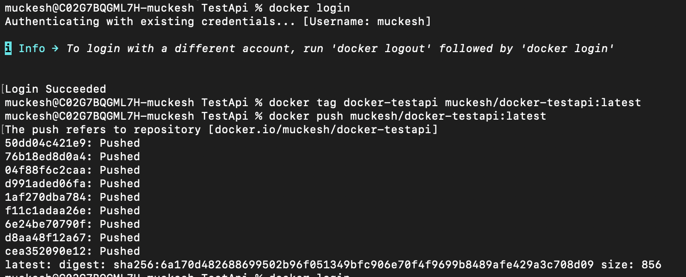

## 4. Downloaded .pem file and established SSH Connection with the VM.

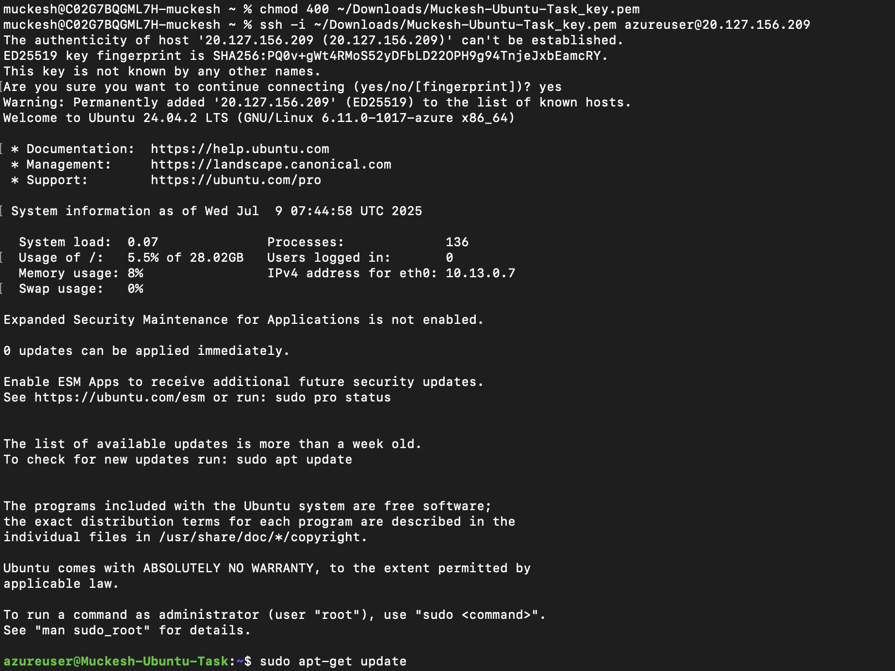

## 5. Install and run docker in the VM.

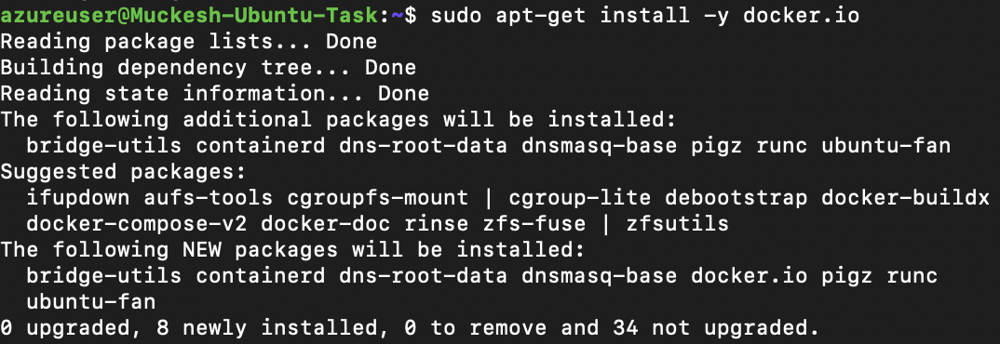

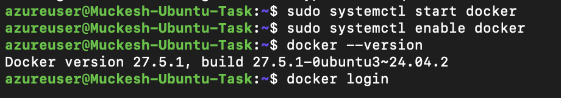


## 6. Logged into docker hub in VM

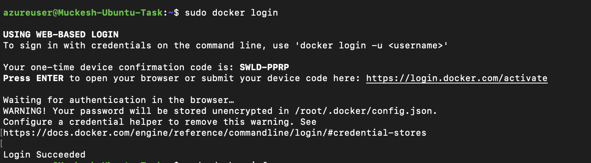

## 7. Pull the image from docker hub inside VM

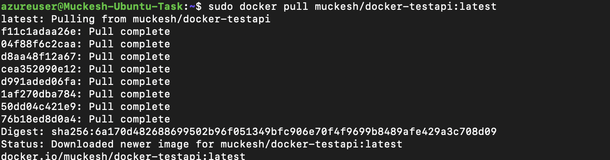

## 8. Created an inbound rule to expose port 8080

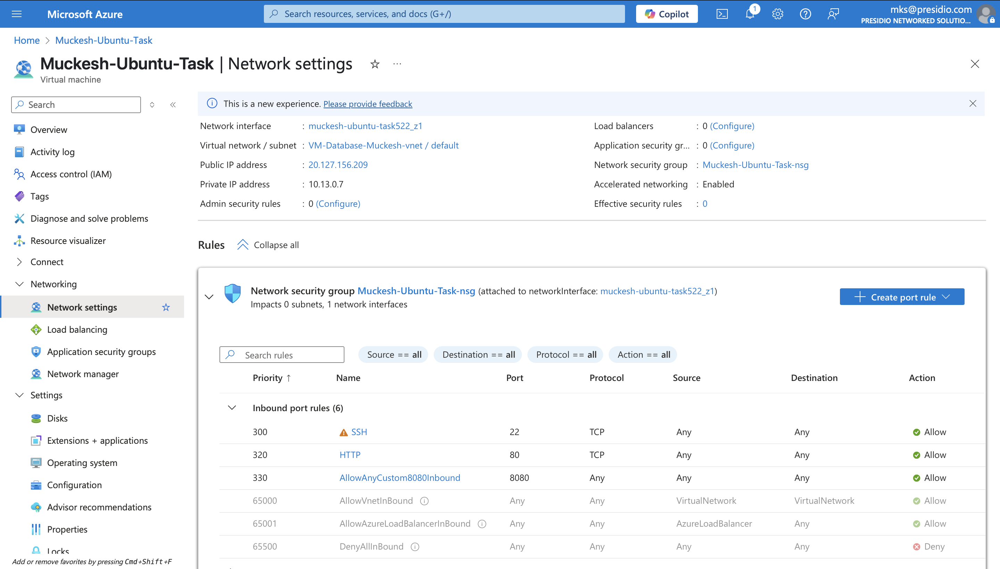

## 9. Run the image inside the VM

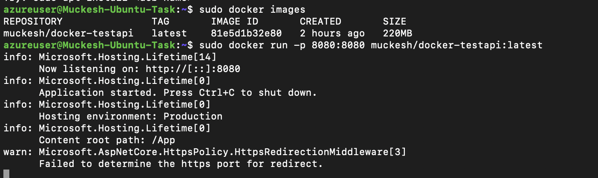

## 10. View the output in local machine with the public ip of VM

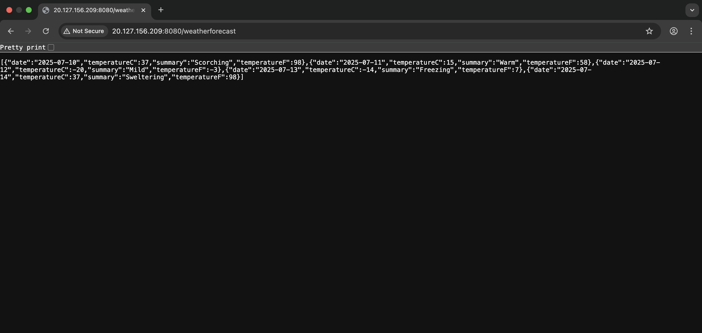